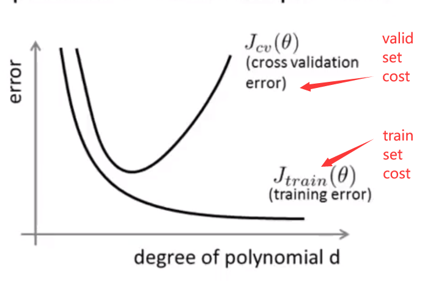
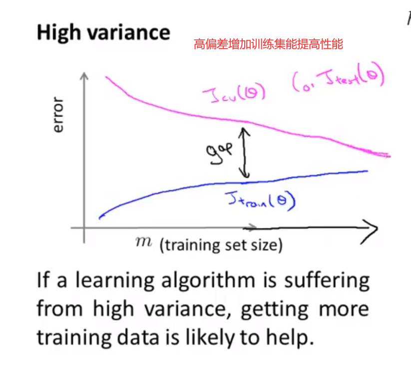
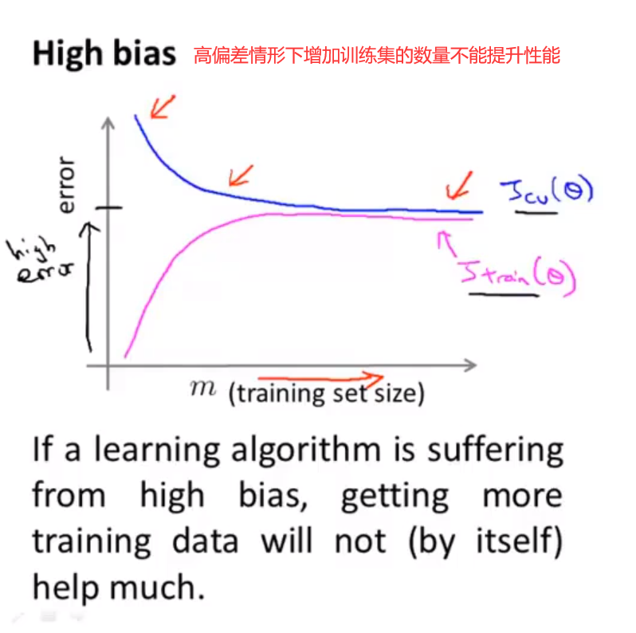

# 1、数据集分类

##### 数据集一般分为

- 训练集（训练模型）60%
- 验证集（选择合适的模型）20%
- 测试集（测试选择的模型的误差）20%

# 2、提高多项式的次数，可以提高拟合程度。

 - overfit（过拟合） 高方差

当次数过于高时，在训练时，我们会得到非常拟合训练集的模型，但是这种模型在验证集上并不能用有很好的表现，如下图，随着x轴两条曲线会相差越来越大。这种情况也被称为**高方差**

 - underfit（欠拟合）高偏差

当次数较低时，我们得到的模型在训练集上也与实际情况相去甚远，在验证集合上，也不能很好的拟合，所以当x轴坐标较小时，我们可以看到两条曲线相差很小，但是误差都很高，这种情况也成为**高偏差**

# 3、高偏差与高方差的判断与处理

