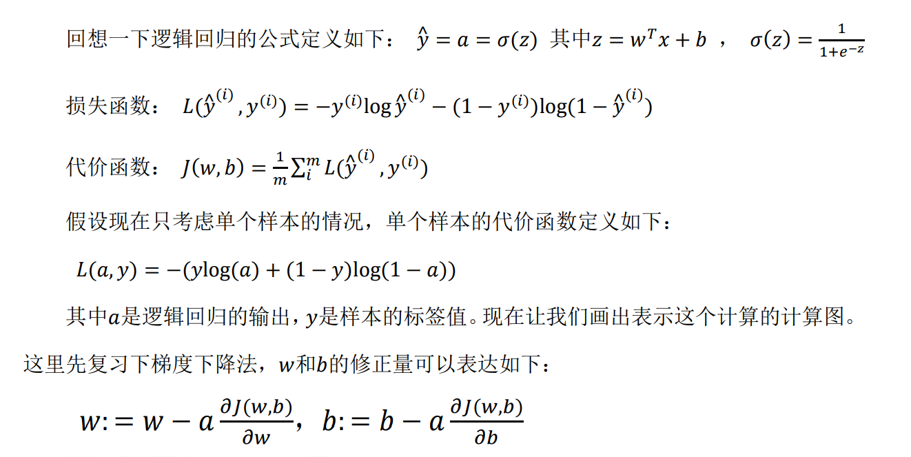
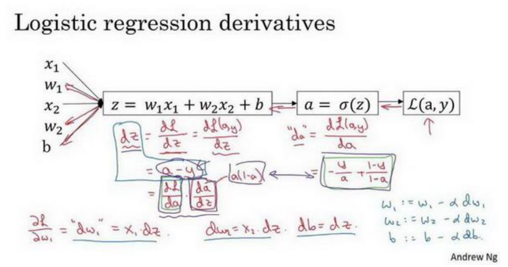

# 最小二乘法 and 梯度下降法

线性回归问题中，我们往往需要得到最优解（或者说最可能的预测值），总之我们需要做的一件事情就是使得我们的线性回归方程更好的拟合实际情况，线性方程一般如下

> ![[公式]](https://www.zhihu.com/equation?tex=%5Chat%7By%7D%28%5Ctheta%2C+x%29+%3D+%5Ctheta_0+%2B+%5Ctheta_1+x_1+%2B+...+%2B+%5Ctheta_p+x_p)
>
> 其中 ![[公式]](https://www.zhihu.com/equation?tex=%5Chat%7By%7D) 是预测值
>
> ![[公式]](https://www.zhihu.com/equation?tex=%5Ctheta_0++%5Ctheta_1+...++%5Ctheta_p) 是系数
>
> ![[公式]](https://www.zhihu.com/equation?tex=x_0++x_1+...++x_p) 是自变量

我们想要让这个方程拟合的非常好，那么就要使误差尽量小，评价误差小的方法就是**所有误差的平方和最小**

计算误差平方和最小的方法最常见的就是**最小二乘法和梯度下降法**

## 最小二乘法

简单地说，最小二乘的思想就是要使得观测点和估计点的距离的平方和达到最小.这里的“二乘”指的是用平方来度量观测点与估计点的远近（在古汉语中“平方”称为“二乘”），“最小”指的是参数的估计值要保证各个观测点与估计点的距离的平方和达到最小。从这个上也可以看出，最小二乘也可用于拟合数据模型。

最小二乘法是所有有数学思维的人面对这个问题第一想到的方法，最直接最不拐弯抹角的方法。就是**求多元函数极值**，这就是最小二乘法的思想！其实根本不用把最小二乘法想的多么高大上，不就是求极值嘛~

学过大学高等数学的人应该都知道求极值的方法：**就是求偏导，然后使偏导为0**，这就是最小二乘法整个的方法了，so easy啊~

![[公式]](https://www.zhihu.com/equation?tex=%E2%88%B5e_i%3Dy_i-%5Chat%7By%7D%5C%5C+%5Chat%7By%7D%3D%28%5Ctheta%2C+x%29+%3D+%5Ctheta_0+%2B+%5Ctheta_1+x_1+%2B+...+%2B+%5Ctheta_p+x_p%5C%5C+%E2%88%B4e_i%3Dy_i-%28%5Chat%7B%5Ctheta_0%7D+%2B+%5Chat%7B%5Ctheta_1%7D+x_1+%2B+...+%2B+%5Chat%7B%5Ctheta_p%7D+x_p%29%5C%5C+Q%3D%5CSigma_%7Bi%3D1%7D%5Ene_i%5E2%3D%5CSigma_%7Bi%3D1%7D%5En%28y_i-%28%5Chat%7B%5Ctheta_0%7D+%2B+%5Chat%7B%5Ctheta_1%7D+x_1+%2B+...+%2B+%5Chat%7B%5Ctheta_p%7D+x_p%29%29%5E2%5C%5C+)

最后使所有的偏导等于0

![[公式]](https://www.zhihu.com/equation?tex=%5Cfrac%7B%5Cpartial%7BQ%7D%7D%7B%5Cpartial%7B%5Chat%7B%5Ctheta_0%7D%7D%7D%3D0%5C%5C+%5Cfrac%7B%5Cpartial%7BQ%7D%7D%7B%5Cpartial%7B%5Chat%7B%5Ctheta_1%7D%7D%7D%3D0%5C%5C+%5Cfrac%7B%5Cpartial%7BQ%7D%7D%7B%5Cpartial%7B%5Chat%7B%5Ctheta_2%7D%7D%7D%3D0%5C%5C......)

然后解这个方程组就可以得到各个系数的值了

## 最小二乘法的矩阵形式

但是一般情况下实现最小二乘法时，我们会采用矩阵的形式

![[公式]](https://www.zhihu.com/equation?tex=%5Cleft+%5B+%5Cbegin%7Bmatrix%7D+x_1%5E0+%26+x_1%5E1+%26x_1%5E2+%26+...+%26+x_1%5E%7Bm-1%7D+%5C%5C+x_2%5E0+%26+x_2%5E1+%26x_2%5E2+%26+...+%26+x_2%5E%7Bm-1%7D+%5C%5C+%5Cvdots+++%26+%5Cvdots+%26+%5Cvdots+%26+%5Cddots++%26+%5Cvdots++%5C%5C+x_n%5E0+%26+x_n%5E1+%26x_n%5E2+%26+...+%26+x_n%5E%7Bm-1%7D+%5C%5C+%5Cend%7Bmatrix%7D+%5Cright%5D++%5Cleft%5B+%5Cbegin%7Bmatrix%7D+a_0+%5C%5C+a_1+%5C%5C+%5Cvdots%5C%5C+a_n+%5Cend%7Bmatrix%7D+%5Cright%5D+%3D++%5Cleft%5B+%5Cbegin%7Bmatrix%7D+f%28x_1%29+%5C%5C+f%28x_2%29%5C%5C+%5Cvdots+%5C%5C+f%28x_n%29+%5C%5C+%5Cend%7Bmatrix%7D+%5Cright%5D)

上述矩阵方程记为 ![[公式]](https://www.zhihu.com/equation?tex=A+%5Cvec%7BX%7D%3D+%5Cvec%7BF%7D)

观测值 ![[公式]](https://www.zhihu.com/equation?tex=Y) 写为向量的形式，记为 ![[公式]](https://www.zhihu.com/equation?tex=%5Cvec%7BY%7D)

![[公式]](https://www.zhihu.com/equation?tex=%5Cvec%7BY%7D%3D%5Cleft%5B+%5Cbegin%7Bmatrix%7D+y_1%5C%5C+y_2%5C%5C+%5Cvdots+%5C%5C+y_n+%5C%5C+%5Cend%7Bmatrix%7D+%5Cright%5D)

![[公式]](https://www.zhihu.com/equation?tex=%5Cvec%7BX%7D%3D%28A%5ETA%29%5E%7B-1%7DA%5ET%5Cvec%7BY%7D)

通过输入值X和观测值Y，我们可以确定出参数矩阵A

## 梯度下降法

使用梯度下降时，采用的是一种逐步拟合的想法，不直接求导数为0的点，而是像下山一样，首先选择一个梯度下降最快的方向，然后走α步，因此α不能太长也不能太短，太长会导致无法始终在最优点两边跳跃，太短会使得到达最优点需要很长的时间。

### 以逻辑回归为例

我们在计算时，首先正向计算出损失函数，然后反向计算出 dw（W的倒数）和db（b的倒数），然后进行一次梯度下降（w=w-a * dw，b=b-a * db），获得新的w和b，然后循环，继续进行正向计算损失函数——反向计算偏导——更新w和b——正向计算损失函数。

</

## 区别：

最小二乘适合小数据，因为求逆会带来大量的运算，梯度下降适合大参数量的大网络

## 参考：

[普通最小二乘法的推导证明](https://blog.csdn.net/u011026329/article/details/79183114)

[最小二乘法和梯度下降法有哪些区别？](https://www.zhihu.com/question/20822481)

